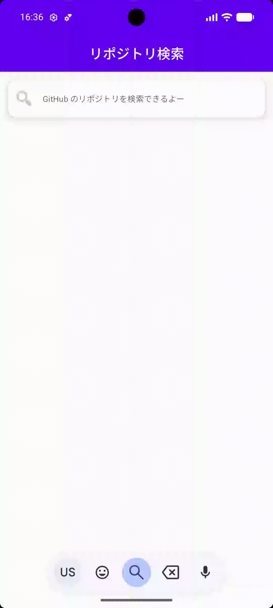

# GitHubリポジトリ検索アプリ

## デモ

## 概要

株式会社ゆめみのAndroidエンジニアコードチェック課題として、既存アプリのリファクタリングを行いました。

## 動作

1. 何かしらのキーワードを入力
2. GitHub API（`search/repositories`）でリポジトリを検索し、結果一覧を概要（リポジトリ名）で表示
3. 特定の結果を選択したら、該当リポジトリの詳細（リポジトリ名、オーナーアイコン、プロジェクト言語、Star 数、Watcher 数、Fork 数、Issue 数）を表示

## 開発環境

| 項目 | バージョン |
|---|---|
| Android Studio | Quail 4 \| 2026.1.4 |
| Gradle | 9.7.1 |
| Android Gradle Plugin | 9.4.0 |
| Kotlin | 2.2.10（AGP 9.4.0が内蔵するコンパイラ） |
| JDK | 17 |
| compileSdk / targetSdk | 37 |
| minSdk | 23 |

- **JDK 17**はAGPが既定とするバージョンで、課題の指定とも一致するため維持しています。
- **minSdk 23**は課題の元の設定を据え置いています。
- **検証環境**：Phone API23 / API36 / API37、Tablet API37の4環境のエミュレータで動作を確認しています。
  実機は持っていなかったため、未確認です。

## ビルド手順

1. リポジトリをクローンし、Android Studioで開く
2. Settings > Build, Execution, Deployment > Build Tools > Gradleで、Gradle JDKにJDK 17を指定する
3. `app`構成で実行する

## テスト実行

テストは次のコマンドで実行できます。

- UnitTest: `./gradlew :app:testDebugUnitTest`
- AndroidTest（エミュレータまたは端末が必要）: `./gradlew :app:connectedDebugAndroidTest`

AndroidTestのうちUIテストはGitHub APIに実際に通信するため、ネットワーク環境やAPIの利用制限によって失敗することがあります。

## アーキテクチャ

MVVM構成です。依存の向きは`ui`から`data`への一方向で、`data`は`ui`やContextに依存しません。

| パッケージ | 役割 |
|---|---|
| ルート | `CodeCheckApplication`（依存の組み立て、画像読み込みの設定）と`MainActivity`。AndroidManifestに登録するクラスだけを置いています |
| `data` | GitHub APIとの通信（`GitHubApi`）、JSONの検証と変換（`RepositoryResponseParser`）、その取りまとめ（`DefaultGitHubRepository`） |
| `model` | 画面間で受け渡すデータ（`RepositoryItem`） |
| `network` | 画像取得用の通信設定（API 24以下向けの証明書設定を含む） |
| `ui/search` | 検索画面のFragment・ViewModel・画面状態 |
| `ui/detail` | 詳細画面のFragment・ViewModel・画面状態 |
| `ui/common` | 通知ダイアログと、その表示制御（`NotificationDialogHost`） |

- **DIライブラリは使わず、依存は`Application`で手動で組み立てています。**  
  2画面の規模では、ライブラリの導入に見合う効果がないと判断しました。
- **UseCase層は置いていません。**  
  ViewModelとRepositoryの間に分けるべき業務ロジックがないためです。
- **データ取得のインターフェースは画面ごとに分けています**（`RepositorySearchDataSource` / `RepositoryDetailDataSource`）。  
  各ViewModelが使わないメソッドに依存せず、テストでの差し替えも最小限で済むと考えました。

## CI

GitHub Actionsで次のジョブを実行します。

| ジョブ | 内容 | 実行条件 |
|---|---|---|
| `ktlint` | コード整形の確認 | Pull Request、`main`へのpush |
| `build` | Debug・ReleaseビルドとAndroid Lint | Pull Request、`main`へのpush |
| `unit-test` | UnitTestの全件実行 | Pull Request、`main`へのpush |
| `tag` | 上の3つが成功した場合に、バージョンに応じたタグを作成 | **`main`へのpushのみ** |

AndroidTestはCIに含めていません。  
UIテストが実際のGitHub APIに通信するため、コードと関係のない理由（ネットワークやAPIの利用制限）で失敗する可能性があるからです。  
不安定なチェックを必須にすると、本当の失敗も「再実行すれば通る」と扱われやすくなるため、手元での実行にとどめています。

## 未対応事項

- **ページング**：検索APIの仕様（取得上限1,000件、未認証時の利用制限）を調査しましたが、時間の都合上今回は見送りました。  
- **Jetpack Composeへの移行**：課題の主題がリファクタリングであり、XMLレイアウトのまま進めました。
- **リリース用の署名設定**：署名鍵を公開リポジトリに置けず、CIへ組み込むにはSecretsの運用が必要になるため見送りました。  
  Releaseビルド自体は縮小・難読化を有効にして通しており、  
  成果物は`-release-unsigned`の名前で署名がないことが分かるようにしています。
- **Android Lintの`Overdraw`警告**：実測で重ね描きが起きていない誤検出と判断し、抑制せずに残しています（#45）

## AIの利用について

**Claude**をPull Request、リリースノート、コミットメッセージの下書き作成に使用しました。  
[使用したプロンプト](https://github.com/sidadora/android-engineer-codecheck/blob/main/docs/prompt/PullRequestPrompt.md)
